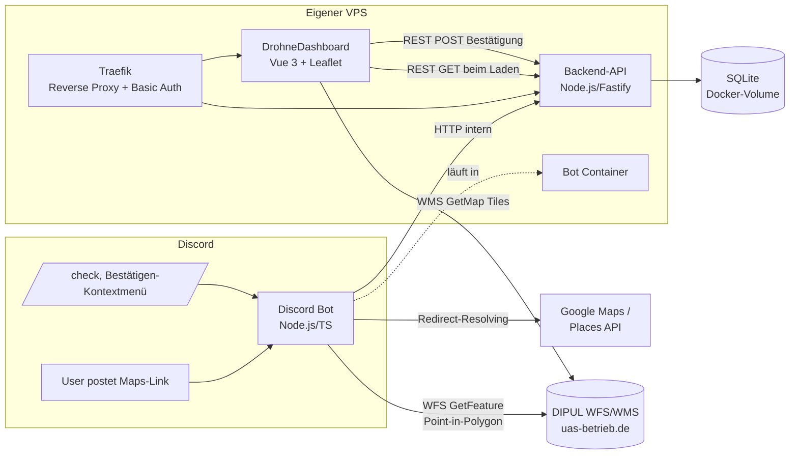

---
tags:
  - claude-generated
  - architektur
  - fpv
  - code
Datum: 2026-09-20
---

# Architektur: Drohnen-Spot-Discord-Bot & DrohneDashboard-Integration

## 1. Überblick

Ein Discord-Bot erkennt Google-Maps-Links in Nachrichten, prüft die Position gegen die DIPUL-Geodaten (Verbots-/Kontrollzonen nach § 21h LuftVO) und speichert den "Spot" in einer SQLite-Datenbank. Eine kleine Backend-API stellt diese Daten für das bestehende [DrohneDashboard](https://github.com/JOHAE96/DrohneDashboard) (Vue 3 + Leaflet) per REST bereit; das Dashboard zeigt die Spots zusammen mit den DIPUL-Zonen-Layern auf einer Karte an. Nutzer können einen Spot als "war ich da fliegen" markieren, und im Discord selbst per Slash-Command bzw. Message-Context-Menu manuell Positionen prüfen und Spots bestätigen.

## 2. Systemlandschaft



## 3. Tech-Stack

| Komponente | Technologie |
|---|---|
| Discord-Bot | Node.js, TypeScript, discord.js |
| Geo-Resolving | Google Places API (für Place-Links ohne Koordinaten) |
| Zonen-Check | DIPUL WFS 2.0.0 (GeoServer), `EPSG:4326` (= WGS84, kompatibel zu Google-Koordinaten, keine Reprojektion nötig) |
| Backend-API | Node.js + Fastify (oder Express), `better-sqlite3` |
| Datenhaltung | SQLite-Datei in Docker-Volume, verwaltet ausschließlich durch die Backend-API |
| Dashboard | Vue 3, Vuex, Vue-Router, Leaflet, Tailwind (bestehendes Repo) — liest Spots per REST statt Firestore-Live-Listener |
| Kartendarstellung Zonen | DIPUL WMS 1.3.0 (`GetMap` als Bild-Overlay, `GetFeatureInfo` für Klick-Details) — bereits im Dashboard implementiert |
| Reverse Proxy / Zugriffsschutz | Traefik mit Basic-Auth-Middleware, auf demselben VPS |
| Deployment | Docker Compose (Bot-Container + API-Container + Dashboard-Container hinter Traefik) |

**Hinweis:** Da SQLite eine reine Datei ohne Netzwerkprotokoll ist, kann der Browser (Vue-Frontend) nicht direkt darauf zugreifen — die Backend-API ist dafür zwingend nötig, nicht optional. Bot und API können denselben Container/Prozess teilen oder getrennt laufen; getrennt ist sauberer (Bot bleibt reiner Discord-Client, API reiner HTTP-Server auf derselben SQLite-Datei über ein gemeinsames Docker-Volume — dabei nur *ein* Schreibprozess gleichzeitig, um SQLite-Lock-Probleme zu vermeiden. Empfehlung: nur die API schreibt, der Bot ruft die API per internem HTTP-Call auf, statt selbst auf die Datei zuzugreifen).

## 4. Datenmodell (SQLite)

```sql
CREATE TABLE spots (
  id TEXT PRIMARY KEY,
  lat REAL NOT NULL,
  lng REAL NOT NULL,
  original_maps_link TEXT NOT NULL,
  description TEXT,
  suggested_by TEXT NOT NULL,          -- Discord-Username
  discord_message_id TEXT NOT NULL,    -- für Message-Context-Menu-Abgleich
  discord_message_link TEXT NOT NULL,
  created_at TEXT NOT NULL DEFAULT (datetime('now')),
  zone_status TEXT NOT NULL,           -- 'ok' | 'restricted' | 'unknown'
  zone_names TEXT                      -- JSON-Array betroffener Zonen, z.B. '["Kontrollzonen"]'
);

CREATE TABLE confirmations (
  id INTEGER PRIMARY KEY AUTOINCREMENT,
  spot_id TEXT NOT NULL REFERENCES spots(id),
  name TEXT NOT NULL,                  -- frei eingegebener Anzeigename (localStorage-basiert)
  confirmed_at TEXT NOT NULL DEFAULT (datetime('now'))
);

CREATE INDEX idx_confirmations_spot ON confirmations(spot_id);
```

**Hinweis zur Datenintegrität:** Da die Bestätigung nicht auf einem echten Login basiert (geteiltes Basic-Auth-Passwort), ist `confirmations` nicht manipulationssicher — für eine kleine, vertrauensbasierte Community eine bewusst akzeptierte Einschränkung.

## 5. Backend-API — Endpunkte

| Methode | Pfad | Zweck |
|---|---|---|
| `GET` | `/api/spots` | Alle Spots inkl. Bestätigungs-Anzahl (fürs Dashboard) |
| `POST` | `/api/spots` | Neuen Spot anlegen (nur vom Bot aufgerufen, internes Netzwerk) |
| `GET` | `/api/spots/:id` | Einzelner Spot inkl. Bestätigungsliste |
| `POST` | `/api/spots/:id/confirmations` | Bestätigung hinzufügen (`{ name: string }`) |
| `GET` | `/api/spots/by-message/:discordMessageId` | Spot über Discord-Message-ID finden (für Context-Menu-Command) |

Die Bot-internen Calls (`POST /api/spots`, Lookup by-message) laufen im internen Docker-Netzwerk ohne Traefik/Basic-Auth. Die vom Dashboard genutzten Endpunkte laufen hinter Traefik + Basic-Auth wie das Dashboard selbst.

## 6. Discord-Bot: Funktionen

### 6.1 Automatische Erkennung (messageCreate)

1. Regex-Scan auf Google-Maps-URL-Varianten (`@lat,lng`, `?q=`, `!3d!4d`, Kurzlinks `maps.app.goo.gl/*`)
2. Kurzlinks per HTTP-Redirect auflösen (`fetch` mit `redirect: 'manual'`, `Location`-Header lesen)
3. Falls keine Koordinaten im Link (Place-Link) → Google Places API (Place Details) für `geometry.location`
4. Parallel: DIPUL-Kartenlink bauen + WFS-Zonen-Check (siehe Abschnitt 7)
5. `POST /api/spots` an Backend-API
6. Discord-Antwort als Embed: Link zur DIPUL-Karte + ✅/🚫-Kurzstatus + Link zum Dashboard-Eintrag

### 6.2 Slash-Command `/check <link-oder-koordinaten>`

Manueller Zonen-Check ohne Spot anzulegen — nimmt entweder einen Google-Maps-Link oder direkt `lat,lng` als Text-Parameter entgegen, durchläuft dieselbe Resolving- und WFS-Pipeline wie oben, antwortet aber nur (ephemeral oder öffentlich, TBD) mit dem Ergebnis — **kein** DB-Eintrag.

### 6.3 Message-Context-Menu-Command "Bestätigen"

Discord-Feature: Rechtsklick auf eine Nachricht → *Apps → Bestätigen*. Discord liefert dabei automatisch die `messageId` der angeklickten Nachricht. Ablauf:

1. Bot ruft `GET /api/spots/by-message/:discordMessageId` auf
2. Falls gefunden → `POST /api/spots/:id/confirmations` mit `{ name: <Discord-Username> }`
3. Antwort (ephemeral) an den Nutzer: "✅ Bestätigt" oder "❌ Kein Spot zu dieser Nachricht gefunden"

Kein Thread-Management nötig, keine zusätzlichen Berechtigungen, kein Copy-Paste von Links durch den Nutzer.

## 7. DIPUL-Integration — Details

**WFS-Endpoint:** `https://uas-betrieb.de/geoservices/dipul/wfs`
**WMS-Endpoint:** `https://uas-betrieb.de/geoservices/dipul/wms`
**CRS:** `EPSG:4326` (WGS84 — direkt kompatibel mit Google-Koordinaten)

**Beispiel Point-in-Polygon-Abfrage (WFS GetFeature):**

```
GET https://uas-betrieb.de/geoservices/dipul/wfs
  ?service=WFS
  &version=2.0.0
  &request=GetFeature
  &typeNames=dipul:kontrollzonen,dipul:flugbeschraenkungsgebiete,dipul:naturschutzgebiete,...
  &outputFormat=application/json
  &srsName=EPSG:4326
  &CQL_FILTER=INTERSECTS(geom,POINT({lng} {lat}))
```

⚠️ **Offener Punkt:** Der exakte Name des Geometrie-Attributs (`geom` ist GeoServer-Standard, aber nicht garantiert) muss einmalig per `DescribeFeatureType`-Request pro Layer verifiziert werden. Einzeiliger Test, kein Architekturrisiko.

**Vollständige Layer-Liste (30 Zonen-Typen, `dipul:`-Präfix):**
`sicherheitsbehoerden`, `bahnanlagen`, `binnenwasserstrassen`, `bundesautobahnen`, `bundesstrassen`, `diplomatische_vertretungen`, `labore`, `ffh-gebiete`, `flugbeschraenkungsgebiete`, `flughaefen`, `flugplaetze`, `freibaeder`, `industrieanlagen`, `internationale_organisationen`, `justizvollzugsanstalten`, `kontrollzonen`, `kraftwerke`, `krankenhaeuser`, `polizei`, `militaerische_anlagen`, `nationalparks`, `naturschutzgebiete`, `behoerden`, `schifffahrtsanlagen`, `seewasserstrassen`, `stromleitungen`, `temporaere_betriebseinschraenkungen`, `inaktive_temporaere_betriebseinschraenkungen`, `umspannwerke`, `vogelschutzgebiete`, `windkraftanlagen`, `wohngrundstuecke`, `modellflugplaetze`

Für den automatisierten Zonen-Check im Bot reicht vermutlich eine Teilmenge (echte Verbots-/Kontrollzonen: `kontrollzonen`, `flugbeschraenkungsgebiete`, `naturschutzgebiete`, `nationalparks`, `vogelschutzgebiete`, `ffh-gebiete`, `wohngrundstuecke`, `temporaere_betriebseinschraenkungen`, u.a.) — die vollständige Liste wie im bestehenden Dashboard nur für die visuelle Kartendarstellung.

## 8. Dashboard-Erweiterung

- **Spots-Layer:** Neue Leaflet-Marker-Layer, geladen per `GET /api/spots` beim Seitenaufruf (kein Live-Sync — Seite neu laden zeigt neue Spots/Bestätigungen, wie gewünscht)
- **Spot-Popup:** Zeigt `description`, `suggested_by`, Link zu `original_maps_link`, Zonen-Check-Status, sowie Bestätigungs-Button
- **"War ich da fliegen"-Mechanismus** (kein echter Login, da geteiltes Basic-Auth-Passwort):
  1. Erstes Bestätigen → Prompt nach Anzeigename, gespeichert in `localStorage`
  2. Bestätigte Spot-IDs zusätzlich in `localStorage` gemerkt → Button wird für diesen Browser deaktiviert
  3. `POST /api/spots/:id/confirmations` mit `{ name }`

## 9. Deployment (VPS)

```yaml
# docker-compose.yml (Auszug)
services:
  traefik:
    image: traefik:v3
    command:
      - "--providers.docker=true"
      - "--entrypoints.websecure.address=:443"
    labels:
      - "traefik.http.middlewares.basic-auth.basicauth.users=<htpasswd-hash>"
    ports:
      - "443:443"
    volumes:
      - "/var/run/docker.sock:/var/run/docker.sock:ro"

  api:
    build: ./backend-api
    volumes:
      - "sqlite-data:/data"    # spots.db liegt hier
    labels:
      - "traefik.http.routers.api.rule=Host(`dashboard.example.com`) && PathPrefix(`/api`)"
      - "traefik.http.routers.api.middlewares=basic-auth"
      - "traefik.http.routers.api.tls.certresolver=le"

  dashboard:
    build: ./drohne-dashboard
    labels:
      - "traefik.http.routers.dashboard.rule=Host(`dashboard.example.com`)"
      - "traefik.http.routers.dashboard.middlewares=basic-auth"
      - "traefik.http.routers.dashboard.tls.certresolver=le"

  discord-bot:
    build: ./discord-bot
    restart: always
    env_file: .env
    depends_on:
      - api
    # kein Traefik-Routing nötig, spricht die API intern an (z.B. http://api:3000)

volumes:
  sqlite-data:
```

`.env` (Bot): `DISCORD_TOKEN`, `GOOGLE_PLACES_API_KEY`, `INTERNAL_API_URL` (z.B. `http://api:3000`), `DIPUL_WFS_URL`

## 10. Offene Punkte / Nächste Schritte

- [ ] `DescribeFeatureType` je relevantem Layer prüfen → Geometrie-Attributname bestätigen
- [ ] Exakte Query-Parameter von `maptool-dipul.dfs.de` verifizieren (Live-Seite inspizieren)
- [ ] SQLite-Backups regeln (z.B. Volume-Snapshot oder Litestream), da einzelne Datei = Single Point of Failure
- [ ] Umgang mit mehreren Maps-Links in einer Nachricht festlegen
- [ ] Embed-Design im Discord final abstimmen
- [ ] `/check`: Antwort ephemeral oder öffentlich im Channel?
