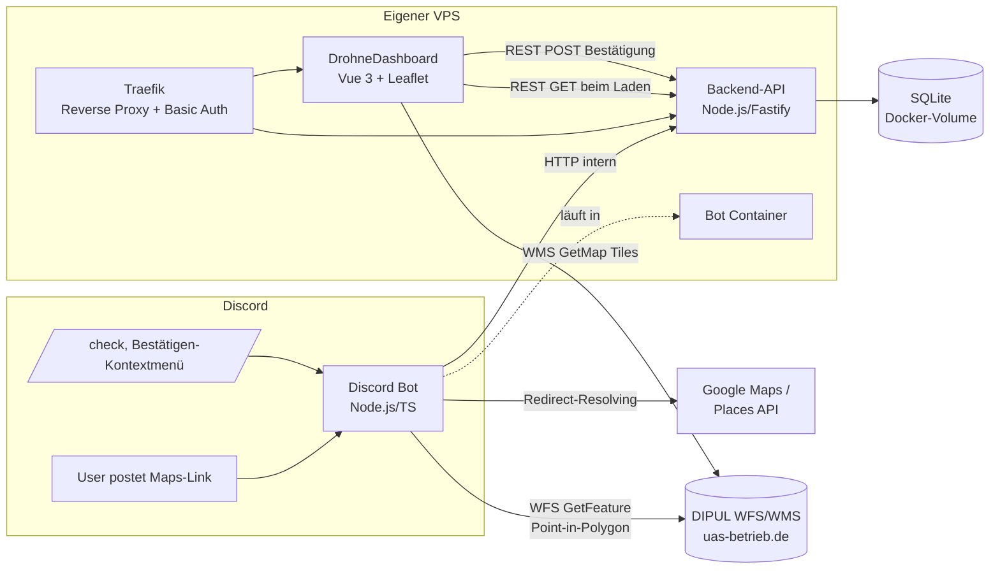

---
tags:
  - claude-generated
  - architektur
  - fpv
  - code
Datum: 2026-09-20
---

# Architektur: Drohnen-Spot-Discord-Bot & DrohneDashboard-Integration

## 1. Überblick

Ein Discord-Bot erkennt Google-Maps-Links in Nachrichten, prüft die Position gegen die DIPUL-Geodaten (Verbots-/Kontrollzonen nach § 21h LuftVO) und speichert den "Spot" in einer SQLite-Datenbank. Eine kleine Backend-API stellt diese Daten für das bestehende [DrohneDashboard](https://github.com/JOHAE96/DrohneDashboard) (Vue 3 + Leaflet) per REST bereit; das Dashboard zeigt die Spots zusammen mit den DIPUL-Zonen-Layern auf einer Karte an. Nutzer können einen Spot als "war ich da fliegen" markieren, und im Discord selbst per Slash-Command bzw. Message-Context-Menu manuell Positionen prüfen und Spots bestätigen.

## 2. Systemlandschaft



## 3. Tech-Stack

| Komponente | Technologie |
|---|---|
| Discord-Bot | Node.js, TypeScript, discord.js |
| Geo-Resolving | Google Places API (für Place-Links ohne Koordinaten) |
| Zonen-Check | DIPUL WFS 2.0.0 (GeoServer), `EPSG:4326` (= WGS84, kompatibel zu Google-Koordinaten, keine Reprojektion nötig) |
| Backend-API | Node.js + Fastify (oder Express), `better-sqlite3` |
| Datenhaltung | SQLite-Datei in Docker-Volume, verwaltet ausschließlich durch die Backend-API |
| Dashboard | Vue 3, Vuex, Vue-Router, Leaflet, Tailwind (bestehendes Repo) — liest Spots per REST statt Firestore-Live-Listener |
| Kartendarstellung Zonen | DIPUL WMS 1.3.0 (`GetMap` als Bild-Overlay, `GetFeatureInfo` für Klick-Details) — bereits im Dashboard implementiert |
| Reverse Proxy / Zugriffsschutz | Traefik mit Basic-Auth-Middleware, auf demselben VPS |
| Deployment | Docker Compose (Bot-Container + API-Container + Dashboard-Container hinter Traefik) |

**Hinweis:** Da SQLite eine reine Datei ohne Netzwerkprotokoll ist, kann der Browser (Vue-Frontend) nicht direkt darauf zugreifen — die Backend-API ist dafür zwingend nötig, nicht optional. Bot und API können denselben Container/Prozess teilen oder getrennt laufen; getrennt ist sauberer (Bot bleibt reiner Discord-Client, API reiner HTTP-Server auf derselben SQLite-Datei über ein gemeinsames Docker-Volume — dabei nur *ein* Schreibprozess gleichzeitig, um SQLite-Lock-Probleme zu vermeiden. Empfehlung: nur die API schreibt, der Bot ruft die API per internem HTTP-Call auf, statt selbst auf die Datei zuzugreifen).

## 4. Datenmodell (SQLite)

```sql
CREATE TABLE spots (
  id TEXT PRIMARY KEY,
  lat REAL NOT NULL,
  lng REAL NOT NULL,
  original_maps_link TEXT NOT NULL,
  description TEXT,
  suggested_by TEXT NOT NULL,          -- Discord-Username
  discord_message_id TEXT NOT NULL,    -- für Message-Context-Menu-Abgleich
  discord_message_link TEXT NOT NULL,
  created_at TEXT NOT NULL DEFAULT (datetime('now')),
  zone_status TEXT NOT NULL,           -- 'ok' | 'restricted' | 'unknown'
  zone_names TEXT                      -- JSON-Array betroffener Zonen, z.B. '["Kontrollzonen"]'
);

CREATE TABLE confirmations (
  id INTEGER PRIMARY KEY AUTOINCREMENT,
  spot_id TEXT NOT NULL REFERENCES spots(id),
  name TEXT NOT NULL,                  -- frei eingegebener Anzeigename (localStorage-basiert)
  confirmed_at TEXT NOT NULL DEFAULT (datetime('now'))
);

CREATE INDEX idx_confirmations_spot ON confirmations(spot_id);

-- v2: Cache für DIPUL-Zonenprüfungen (nicht im ursprünglichen Entwurf) — getrennt von
-- `spots`, da ein Cache-Eintrag kein vom Nutzer vorgeschlagener Spot ist. Nur 'ok'/
-- 'restricted' werden gecacht, nie 'unknown'. lat/lng werden vom Bot vor dem Schreiben auf
-- 5 Nachkommastellen gerundet (~1,1m), damit nah beieinanderliegende Anfragen denselben
-- Eintrag treffen.
CREATE TABLE zone_cache (
  lat REAL NOT NULL,
  lng REAL NOT NULL,
  status TEXT NOT NULL,                -- 'ok' | 'restricted'
  zone_names TEXT NOT NULL,            -- JSON-Array
  checked_at TEXT NOT NULL DEFAULT (datetime('now')),
  PRIMARY KEY (lat, lng)
);
```

**Hinweis zur Datenintegrität:** Da die Bestätigung nicht auf einem echten Login basiert (geteiltes Basic-Auth-Passwort), ist `confirmations` nicht manipulationssicher — für eine kleine, vertrauensbasierte Community eine bewusst akzeptierte Einschränkung.

## 5. Backend-API — Endpunkte

Implementiert in `backend-api/` (Fastify + `better-sqlite3`), siehe `backend-api/README.md`.

| Methode | Pfad | Zweck |
|---|---|---|
| `GET` | `/health` | Liveness-Check |
| `GET` | `/api/spots` | Alle Spots inkl. Bestätigungs-Anzahl (fürs Dashboard) |
| `POST` | `/api/spots` | Neuen Spot anlegen — nur vom automatischen Link-Scan im Bot (`messageCreate`), **nicht** von `/check` |
| `GET` | `/api/spots/:id` | Einzelner Spot inkl. Bestätigungsliste |
| `POST` | `/api/spots/:id/confirmations` | Bestätigung hinzufügen (`{ name: string }`) |
| `GET` | `/api/spots/by-message/:discordMessageId` | Spot über Discord-Message-ID finden (für Context-Menu-Command) |
| `GET` | `/api/zone-cache?lat=&lng=` | Gecachtes DIPUL-Ergebnis für eine Position, 404 wenn keins vorhanden |
| `POST` | `/api/zone-cache` | Ergebnis cachen (upsert) — **einziger** DB-Schreibzugriff von `/check` |

**v2-Stand:** Die API läuft bisher nur im internen Docker-Netzwerk ohne Traefik/Basic-Auth
(noch kein Dashboard-Zugriff). `/check` legt bewusst **keinen** Spot an, sondern schreibt nur
in `zone_cache` — die "echten" Spots (sichtbar im künftigen Dashboard) entstehen ausschließlich
über den automatischen Link-Scan. Traefik + Basic-Auth für die vom Dashboard genutzten
Endpunkte folgen mit der Dashboard-Erweiterung (Abschnitt 8).

## 6. Discord-Bot: Funktionen

### 6.1 Automatische Erkennung (messageCreate)

1. Regex-Scan auf Google-Maps-URL-Varianten (`@lat,lng`, `?q=`, `!3d!4d`, Kurzlinks `maps.app.goo.gl/*`)
2. Kurzlinks per HTTP-Redirect auflösen (`fetch` mit `redirect: 'manual'`, `Location`-Header lesen)
3. Koordinaten per Regex direkt aus der (aufgelösten) URL extrahieren — **keine Google Places
   API** in v1/v2 implementiert (ursprünglich hier geplant). Reicht in der Praxis, da Google-
   Maps-Links fast immer `@lat,lng` oder `!3d!4d` enthalten; ein reiner Place-Link ganz ohne
   Koordinaten in der URL kann aktuell nicht aufgelöst werden.
4. Zonen-Check cache-first: erst `GET /api/zone-cache`, bei Miss die 30-Layer-WFS-Pipeline
   (Abschnitt 7), Ergebnis danach per `POST /api/zone-cache` ablegen. Parallel: WMS-Kartenbild
   erzeugen (Abschnitt 7.1/Bot-Implementierung)
5. `POST /api/spots` an Backend-API — legt den Spot an (unabhängig vom Zonen-Cache)
6. Discord-Antwort als Embed: WMS-Kartenbild als Anhang, DIPUL-Deep-Link, ✅/🚫/❓-Status
   (+ 1:1-Regel-Hinweis bei Verkehrswegen, Abschnitt 7.1) — noch **kein** Link zum
   Dashboard-Eintrag, da das Dashboard Spots noch nicht darstellt (folgt mit Abschnitt 8)

### 6.2 Slash-Command `/check <link-oder-koordinaten>`

Manueller Zonen-Check ohne Spot anzulegen — nimmt entweder einen Google-Maps-Link oder direkt
`lat,lng` als Text-Parameter entgegen, durchläuft dieselbe Resolving- und cache-first
Zonen-Check-Pipeline wie oben, antwortet ephemeral. **Kein** Eintrag in `spots`; einziger
DB-Zugriff ist das Zonen-Cache-Lesen/Schreiben (`/api/zone-cache`), identisch zum
automatischen Link-Scan.

### 6.3 Message-Context-Menu-Command "Bestätigen"

Discord-Feature: Rechtsklick auf eine Nachricht → *Apps → Bestätigen*. Discord liefert dabei automatisch die `messageId` der angeklickten Nachricht. Ablauf:

1. Bot ruft `GET /api/spots/by-message/:discordMessageId` auf
2. Falls gefunden → `POST /api/spots/:id/confirmations` mit `{ name: <Discord-Username> }`
3. Antwort (ephemeral) an den Nutzer: "✅ Bestätigt" oder "❌ Kein Spot zu dieser Nachricht gefunden"

Kein Thread-Management nötig, keine zusätzlichen Berechtigungen, kein Copy-Paste von Links durch den Nutzer.

## 7. DIPUL-Integration — Details

**WFS-Endpoint:** `https://uas-betrieb.de/geoservices/dipul/wfs`
**WMS-Endpoint:** `https://uas-betrieb.de/geoservices/dipul/wms`
**CRS:** `EPSG:4326` (WGS84 — direkt kompatibel mit Google-Koordinaten)

**Beispiel Point-in-Polygon-Abfrage (WFS GetFeature), verifiziert in `discord-bot/src/lib/dipul.ts`:**

```
GET https://uas-betrieb.de/geoservices/dipul/wfs
  ?service=WFS
  &version=2.0.0
  &request=GetFeature
  &typeNames=dipul:kontrollzonen
  &outputFormat=application/json
  &srsName=EPSG:4326
  &count=1
  &CQL_FILTER=INTERSECTS(geom,POINT({lat} {lng}))
```

✅ **Verifiziert (vormals offene Punkte):**
- Geometrie-Attribut heißt tatsächlich `geom` (GeoServer-Standard bestätigt).
- **Achsreihenfolge im `CQL_FILTER` ist `POINT(lat lng)`, nicht `POINT(lng lat)`** — entgegen der ursprünglichen Annahme oben. Dieser WFS-Dienst wertet `POINT()` bei `srsName=EPSG:4326` in der "CRS-konformen" Reihenfolge lat/lon aus, obwohl die zurückgelieferten GeoJSON-Geometrien selbst ganz normal in lng/lat vorliegen. Live gegen die Frankfurt-Kontrollzone (EDDF) getestet: `POINT(lng lat)` lieferte 0 Treffer trotz Punkt mitten in der Zone, `POINT(lat lng)` den korrekten Treffer.
- ⚠️ **Ein `CQL_FILTER` funktioniert nur mit genau einem `typeNames`-Wert.** Mehrere Layer kommagetrennt in einer Anfrage lässt GeoServer als (ungültigen) Join-Filter fehlschlagen (`ExceptionText: "Extracted invalid join sub-filter ... it uses more than one feature type"`, HTTP 200 mit XML-Fehlerantwort statt JSON). Für einen Multi-Layer-Check sind also N Einzelanfragen nötig (parallel via `Promise.allSettled`), nicht eine kombinierte — siehe `checkZones()`.
- `dipul:modellflugplaetze` existiert **nicht** als WFS-Feature-Type (`ExceptionText: "Feature type dipul:modellflugplaetze unknown"`), nur als WMS-Layer für die Kartendarstellung.

**Vollständige Layer-Liste laut WFS `GetCapabilities`** (siehe `docs/geoserver-GetCapabilities_application.xml`, 30 tatsächlich per WFS abfragbare Feature-Types, `dipul:`-Präfix):
`sicherheitsbehoerden`, `bahnanlagen`, `binnenwasserstrassen`, `bundesautobahnen`, `bundesstrassen`, `diplomatische_vertretungen`, `labore`, `ffh-gebiete`, `flugbeschraenkungsgebiete`, `flughaefen`, `flugplaetze`, `freibaeder`, `industrieanlagen`, `internationale_organisationen`, `justizvollzugsanstalten`, `kontrollzonen`, `kraftwerke`, `krankenhaeuser`, `polizei`, `militaerische_anlagen`, `nationalparks`, `naturschutzgebiete`, `behoerden`, `schifffahrtsanlagen`, `seewasserstrassen`, `stromleitungen`, `temporaere_betriebseinschraenkungen`, `umspannwerke`, `vogelschutzgebiete`, `windkraftanlagen`, `wohngrundstuecke`

(`modellflugplaetze` und `inaktive_temporaere_betriebseinschraenkungen` aus der WMS-Kartendarstellung sind hier bewusst ausgenommen — ersteres da nicht als WFS-Feature-Type vorhanden, letzteres da per Definition nicht aktuell gültig und sonst fälschlich als Treffer gemeldet würde.)

Der Bot fragt für den automatisierten Zonen-Check **alle 30 Layer** ab (eine kleinere Teilmenge hatte in der Praxis reale Treffer übersehen, z.B. in `bundesautobahnen`, `krankenhaeuser` oder `militaerische_anlagen`) — dieselbe Liste wie im Dashboard, nur eben pro Layer einzeln statt kombiniert (s.o.).

### 7.1 Bedingt erlaubte Zonen (1:1-Regel)

Nicht alle Treffer bedeuten ein generelles Flugverbot. Für Verkehrswege gilt die "1:1-Regel":
Betrieb ist bedingt möglich, wenn der horizontale Abstand zur Anlage mindestens der Flughöhe
entspricht — anders als bei echten Sperrzonen (Kontrollzone, Militär, Krankenhaus, Behörde
etc.), wo grundsätzlich nicht geflogen werden darf. Betroffene Layer (`CONDITIONAL_ZONE_LABELS`
in `discord-bot/src/lib/dipul.ts`): `bundesstrassen`, `bahnanlagen`, `bundesautobahnen`,
`binnenwasserstrassen`, `seewasserstrassen`, `schifffahrtsanlagen` (`stromleitungen` bewusst
ausgenommen).

Der Gesamtstatus bleibt bei einem Treffer weiterhin `restricted` (🚫) — die Unterscheidung
ändert nur die Embed-Darstellung: Enthält die Liste der betroffenen Zonen mindestens einen
dieser Layer, hängt `buildZoneEmbed()` (`discord-bot/src/lib/embed.ts`) einen zusätzlichen
Hinweistext an das "Betroffene Zonen"-Feld an, z.B.:

```
• Bundesstraße
• Bahnanlage

⚠️ Für Verkehrswege gilt die 1:1-Regel: Betrieb ist bedingt möglich, wenn der horizontale
Abstand zur Anlage mindestens der Flughöhe entspricht.
```

## 8. Dashboard-Erweiterung

- **Spots-Layer:** Neue Leaflet-Marker-Layer, geladen per `GET /api/spots` beim Seitenaufruf (kein Live-Sync — Seite neu laden zeigt neue Spots/Bestätigungen, wie gewünscht)
- **Spot-Popup:** Zeigt `description`, `suggested_by`, Link zu `original_maps_link`, Zonen-Check-Status, sowie Bestätigungs-Button
- **"War ich da fliegen"-Mechanismus** (kein echter Login, da geteiltes Basic-Auth-Passwort):
  1. Erstes Bestätigen → Prompt nach Anzeigename, gespeichert in `localStorage`
  2. Bestätigte Spot-IDs zusätzlich in `localStorage` gemerkt → Button wird für diesen Browser deaktiviert
  3. `POST /api/spots/:id/confirmations` mit `{ name }`

## 9. Deployment (VPS)

**v2-Stand:** Das tatsächliche `docker-compose.yml` (Repo-Root) enthält bereits `api` +
`discord-bot` (internes Netzwerk, `INTERNAL_API_URL=http://api:3000`, `sqlite-data`-Volume),
aber noch **kein** Traefik und **kein** `dashboard`-Service — das folgt mit der
Dashboard-Erweiterung (Abschnitt 8). Unten der volle Ziel-Zustand fürs echte VPS-Deployment:

```yaml
# docker-compose.yml (Ziel-Zustand, Auszug)
services:
  traefik:
    image: traefik:v3
    command:
      - "--providers.docker=true"
      - "--entrypoints.websecure.address=:443"
    labels:
      - "traefik.http.middlewares.basic-auth.basicauth.users=<htpasswd-hash>"
    ports:
      - "443:443"
    volumes:
      - "/var/run/docker.sock:/var/run/docker.sock:ro"

  api:
    build: ./backend-api
    volumes:
      - "sqlite-data:/data"    # spots.db liegt hier
    labels:
      - "traefik.http.routers.api.rule=Host(`dashboard.example.com`) && PathPrefix(`/api`)"
      - "traefik.http.routers.api.middlewares=basic-auth"
      - "traefik.http.routers.api.tls.certresolver=le"

  dashboard:
    build: ./drohne-dashboard
    labels:
      - "traefik.http.routers.dashboard.rule=Host(`dashboard.example.com`)"
      - "traefik.http.routers.dashboard.middlewares=basic-auth"
      - "traefik.http.routers.dashboard.tls.certresolver=le"

  discord-bot:
    build: ./discord-bot
    restart: always
    env_file: .env
    depends_on:
      - api
    # kein Traefik-Routing nötig, spricht die API intern an (z.B. http://api:3000)

volumes:
  sqlite-data:
```

`.env` (Bot, siehe `discord-bot/.env.example`): `DISCORD_TOKEN`, `DISCORD_CLIENT_ID`,
`INTERNAL_API_URL` (z.B. `http://api:3000`, optional — ohne läuft der Bot weiter, nur ohne
Cache/Speicherung), `DIPUL_WFS_URL`/`DIPUL_WMS_URL` (kein `GOOGLE_PLACES_API_KEY`, siehe
Abschnitt 6.1 Punkt 3).

## 10. Offene Punkte / Nächste Schritte

- [x] Backend-API (`backend-api/`, Fastify + `better-sqlite3`): `spots`/`confirmations`/`zone_cache`, alle Endpunkte aus Abschnitt 5, Bot per HTTP angebunden (Zonen-Cache in `/check` + automatischem Link-Scan, Spot-Anlage nur im Link-Scan)
- [ ] Message-Context-Menu-Command "Bestätigen" (Abschnitt 6.3) — noch nicht implementiert
- [ ] Dashboard-Erweiterung (Abschnitt 8) — Spots-Layer, Popup, Bestätigen-Button
- [ ] Traefik + Basic-Auth vor der API/dem Dashboard, sobald Punkt oben steht (Abschnitt 9)
- [x] `DescribeFeatureType` je relevantem Layer prüfen → Geometrie-Attributname bestätigt (`geom`); zusätzlich Achsreihenfolge im `CQL_FILTER` live verifiziert (`POINT(lat lng)`, nicht `lng lat` — siehe Abschnitt 7) und die Ein-Layer-pro-Anfrage-Einschränkung entdeckt
- [x] Exakte Query-Parameter von `maptool-dipul.dfs.de` verifiziert: kein offizieller Permalink dokumentiert, aber beobachtetes Deep-Link-Format `https://maptool-dipul.dfs.de/geozones/@{lng},{lat}` funktioniert (nicht offiziell dokumentiert, siehe `discord-bot/src/lib/embed.ts`)
- [ ] SQLite-Backups regeln (z.B. Volume-Snapshot oder Litestream), da einzelne Datei = Single Point of Failure
- [ ] Umgang mit mehreren Maps-Links in einer Nachricht festlegen
- [ ] Embed-Design im Discord final abstimmen
- [x] `/check`: Antwort ephemeral (v1-Entscheidung, siehe `discord-bot/src/commands/check.ts`)
